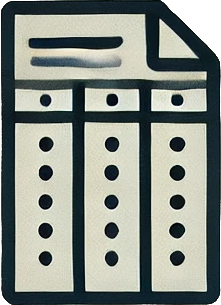
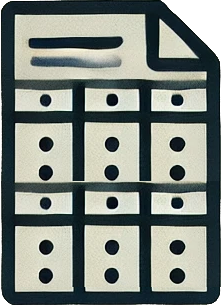
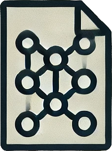

senfd: Semantic Enricher for NVMe Figure Documents
==================================================

.. image:: ../_static/input-document.png
   :alt: Example image description
   :width: 100px
   :align: left

.. toctree::
   :maxdepth: 2
   :caption: Contents:
   :hidden:

   install/index.rst
   usage/index.rst
   schema/index.rst
   contributors/index.rst
